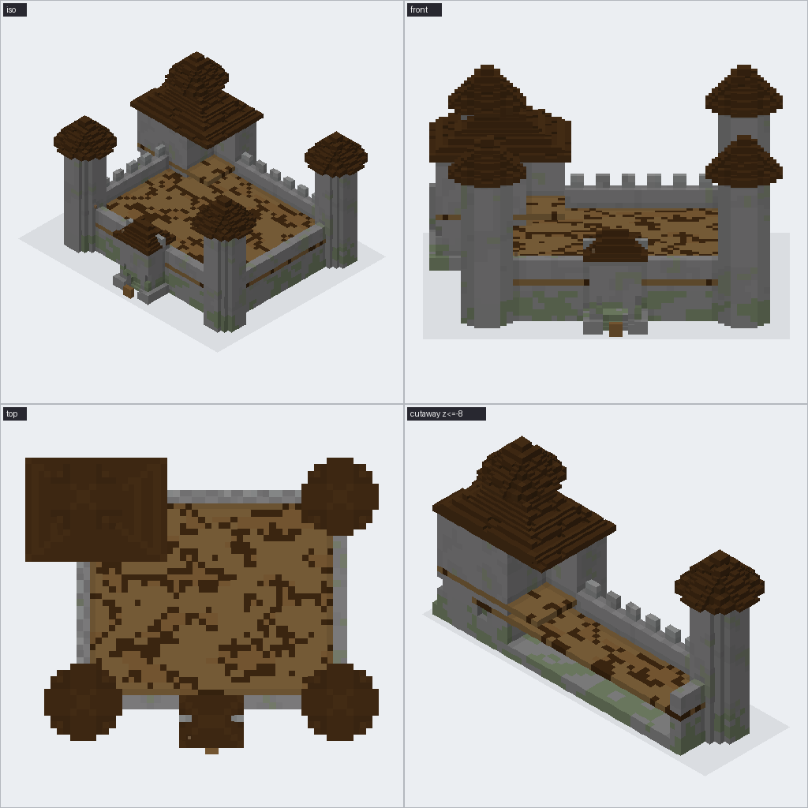
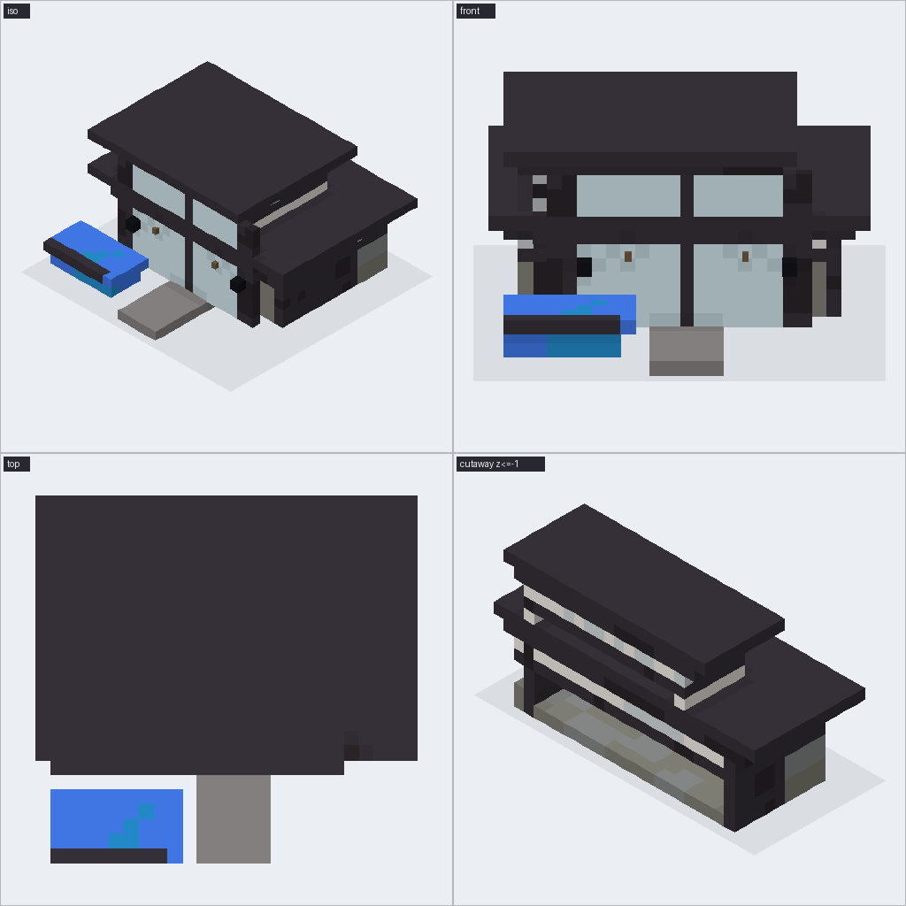
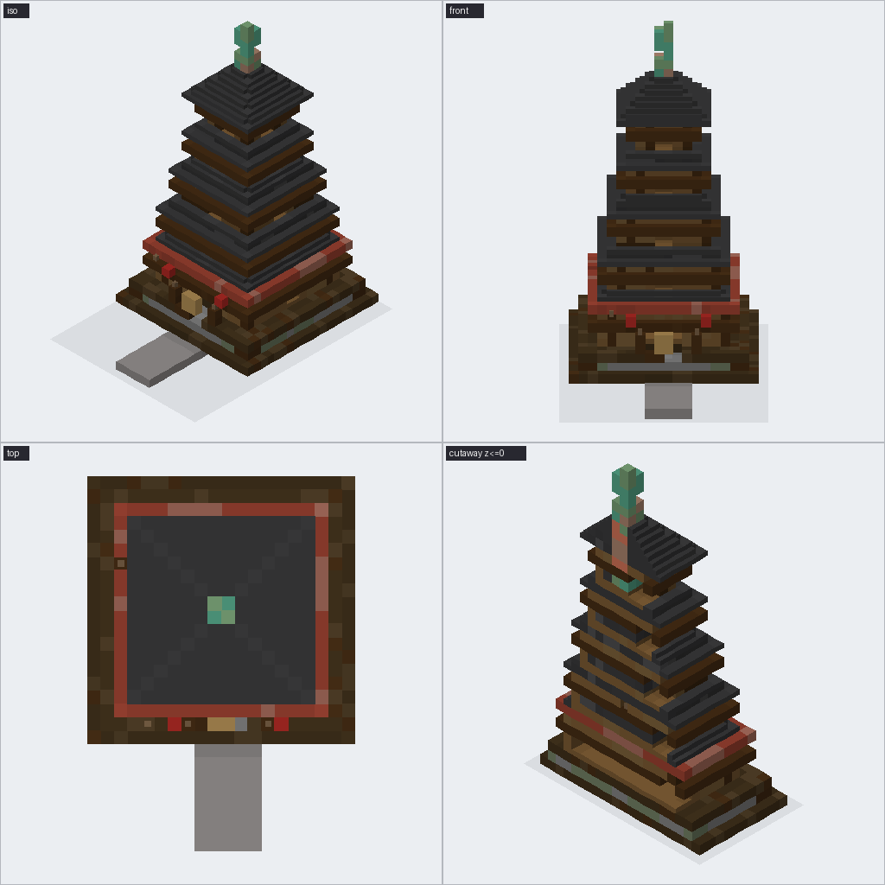
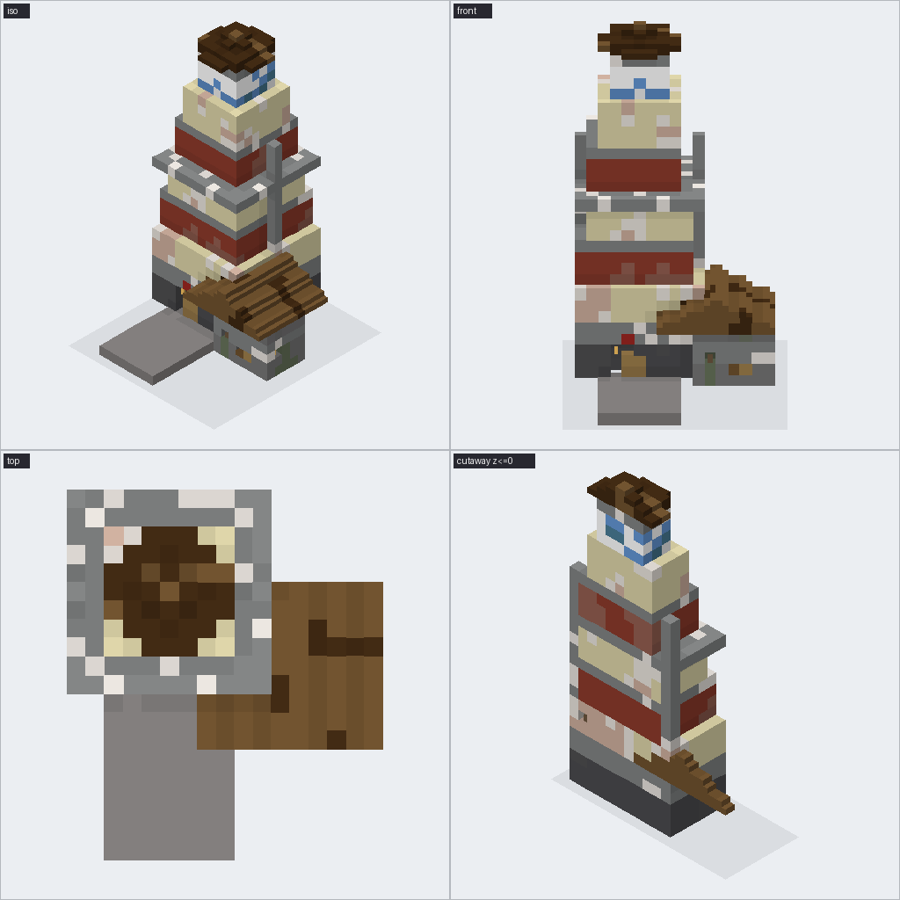
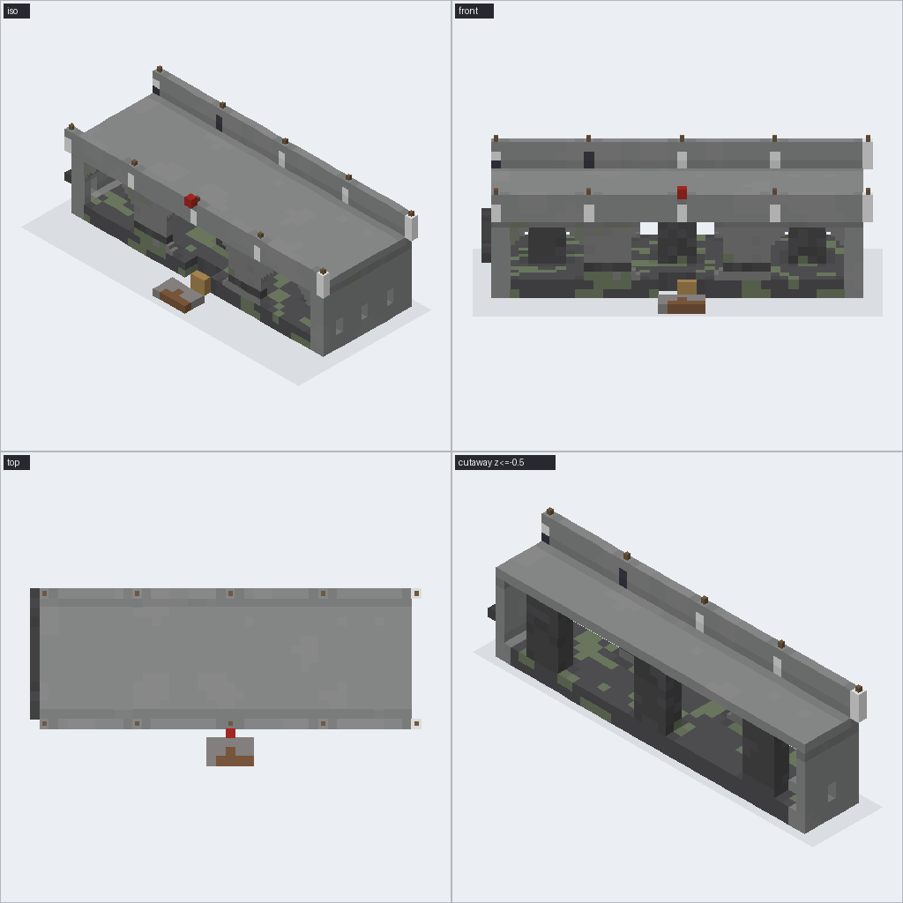

# Bench report 2026-09-19 04:26:03

mode: azure · mean score **6.75**

| build | silhouette | detail | materials | fidelity | mean | tool calls | objects | blocks | wall s | notes |
|---|---|---|---|---|---|---|---|---|---|---|
| medieval_castle | 7 | 6 | 6 | 7 | 6.5 | 28 | 46 | 13155 | 142.2 | The castle reads correctly with four round corner towers, a front-facing gatehou |
| modern_villa | 8 | 7 | 7 | 8 | 7.5 | 21 | 35 | 3307 | 149.6 | The villa reads clearly as a modern two-storey cantilevered build with flat roof |
| japanese_pagoda | 8 | 7 | 7 | 8 | 7.5 | 20 | 75 | 4346 | 150.8 | The five-tier silhouette, central spire, and stone plinth are clearly present an |
| lighthouse | 7 | 6 | 6 | 5 | 6.0 | 27 | 41 | 2683 | 164.1 | Readable tapered lighthouse with the glass lantern room and attached cottage pre |
| stone_bridge | 7 | 6 | 6 | 6 | 6.25 | 20 | 58 | 2722 | 147.2 | The bridge reads clearly with three arches and parapets, but the lanterns are mo |

## medieval_castle

Built castle_v1: castle (medieval stone), 40x32, 26 tall, facing south: L-shaped keep, four round corner towers, curtain walls, gatehouse facing me. 46 objects, 13,155 blocks. stopped after 3 tool calls: stage time budget reached Say what to change (e.g. "make the towers taller", "copper roofs") or 

## modern_villa

Built modern_villa_v1: villa (modern minimalism), 34x28, 14 tall, facing south: two-storey villa, flat roofs, cantilevered upper floor, floor-to-ceiling glass on the front. 35 objects, 3,307 blocks. stopped after 4 tool calls: stage time budget reached Say what to change (e.g. "make the towers talle

## japanese_pagoda

Built five_tier_japanese_pagoda: pagoda (Japanese pagoda), 18x18, 34 tall, facing south: five tiers, sweeping tiered roofs, central spire, stone plinth. 75 objects, 4,346 blocks. stopped after 4 tool calls: stage time budget reached Say what to change (e.g. "make the towers taller", "copper roofs") 

## lighthouse

Built lighthouse_v1: lighthouse (coastal medieval stone), 18x18, 30 tall, facing south: tall tapered lighthouse, red and white bands, glass lantern room on top, small keeper's cottage attached. 41 objects, 2,683 blocks. stopped after 2 tool calls: stage time budget reached Say what to change (e.g. "

## stone_bridge

Built stone_arch_bridge_v1: bridge (medieval stone), 40x14, 12 tall, facing south: three arches, parapets, lanterns on posts. 58 objects, 2,722 blocks. stopped after 4 tool calls: stage time budget reached Say what to change (e.g. "make the towers taller", "copper roofs") or `undo`.
