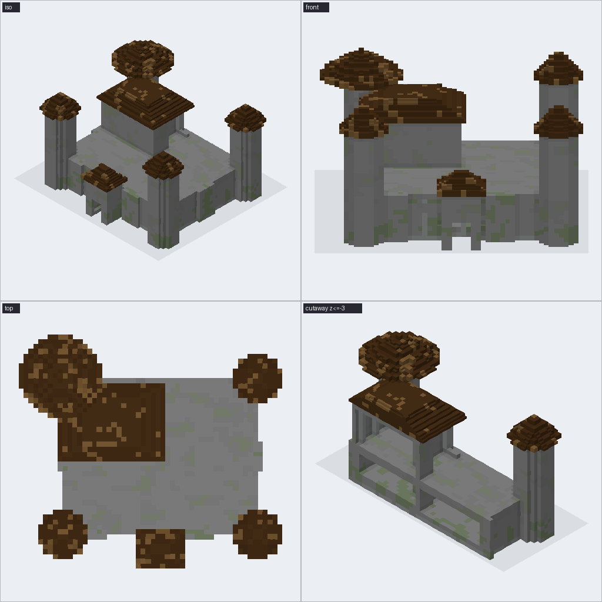
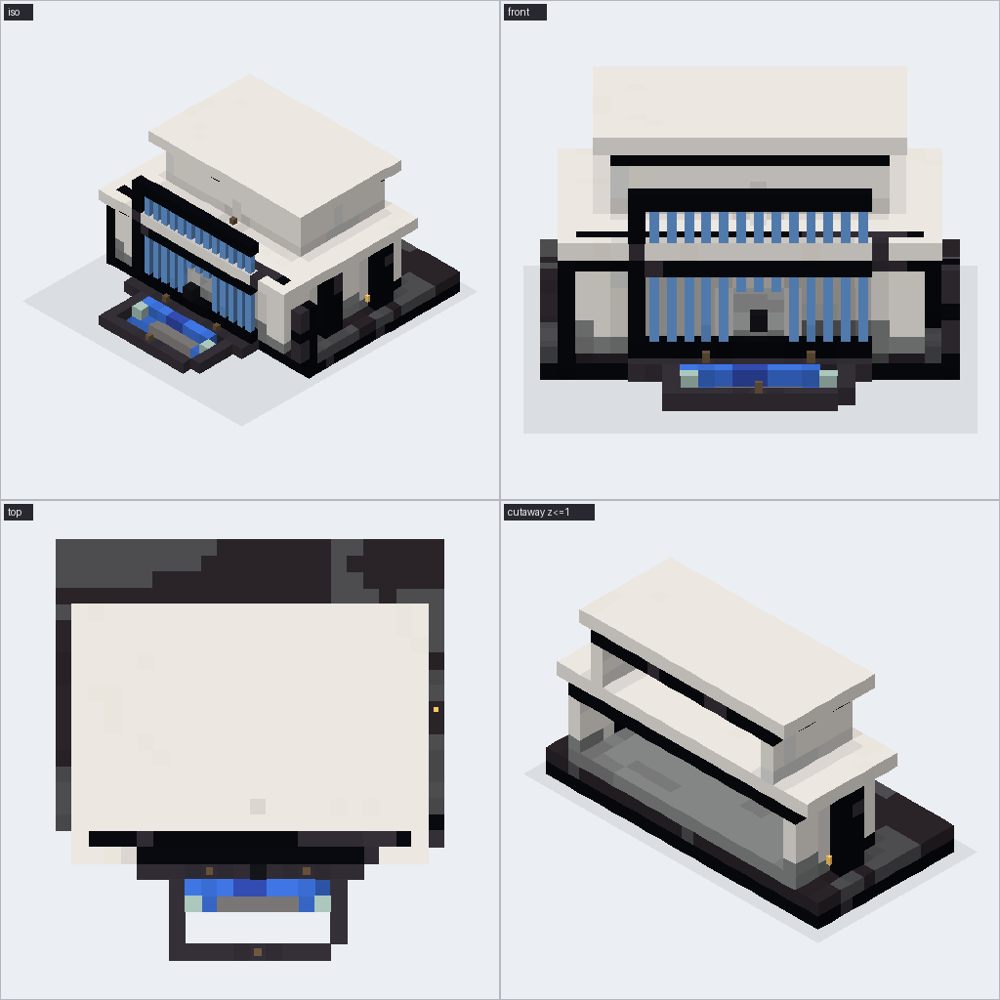
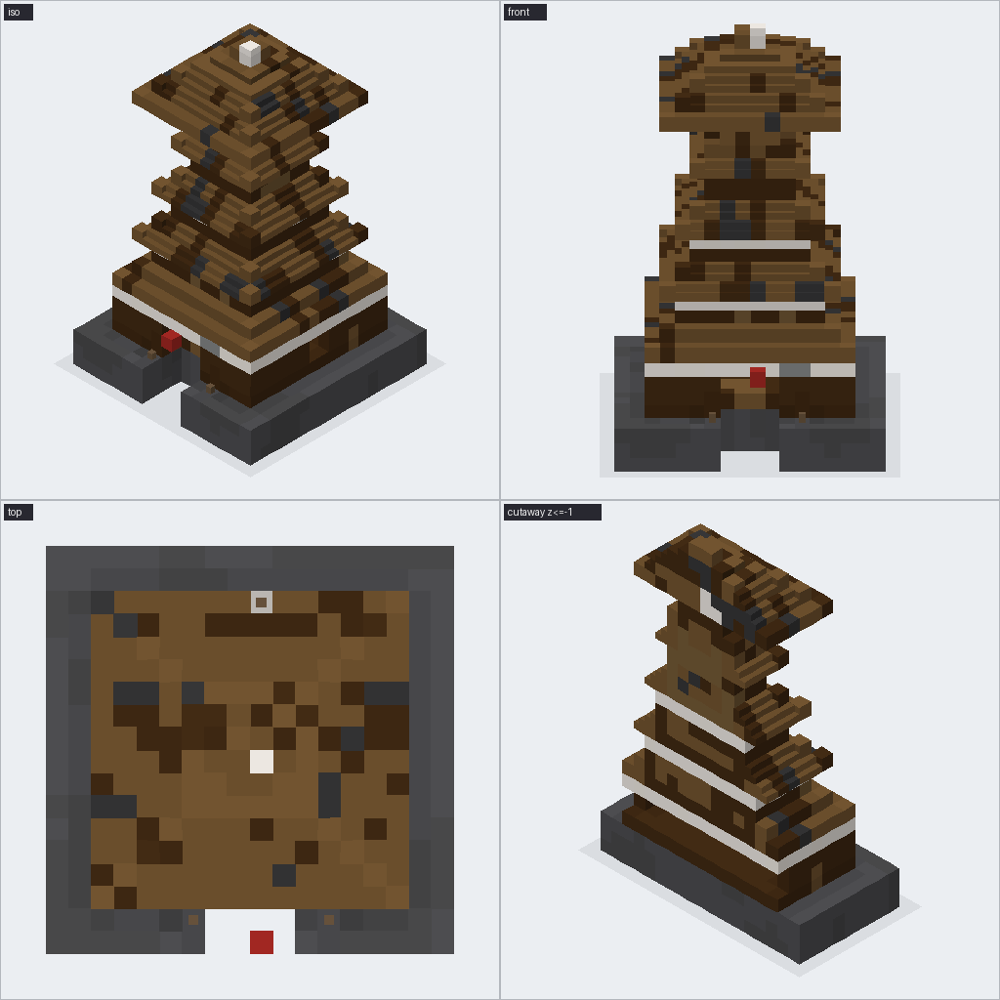
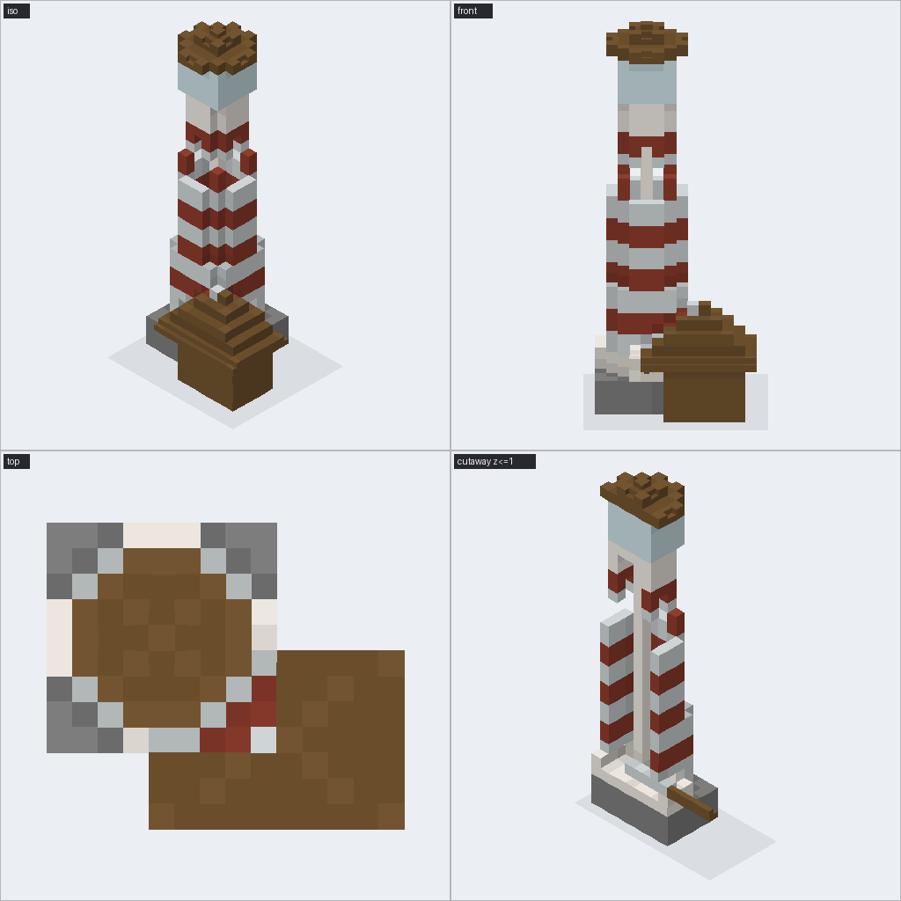
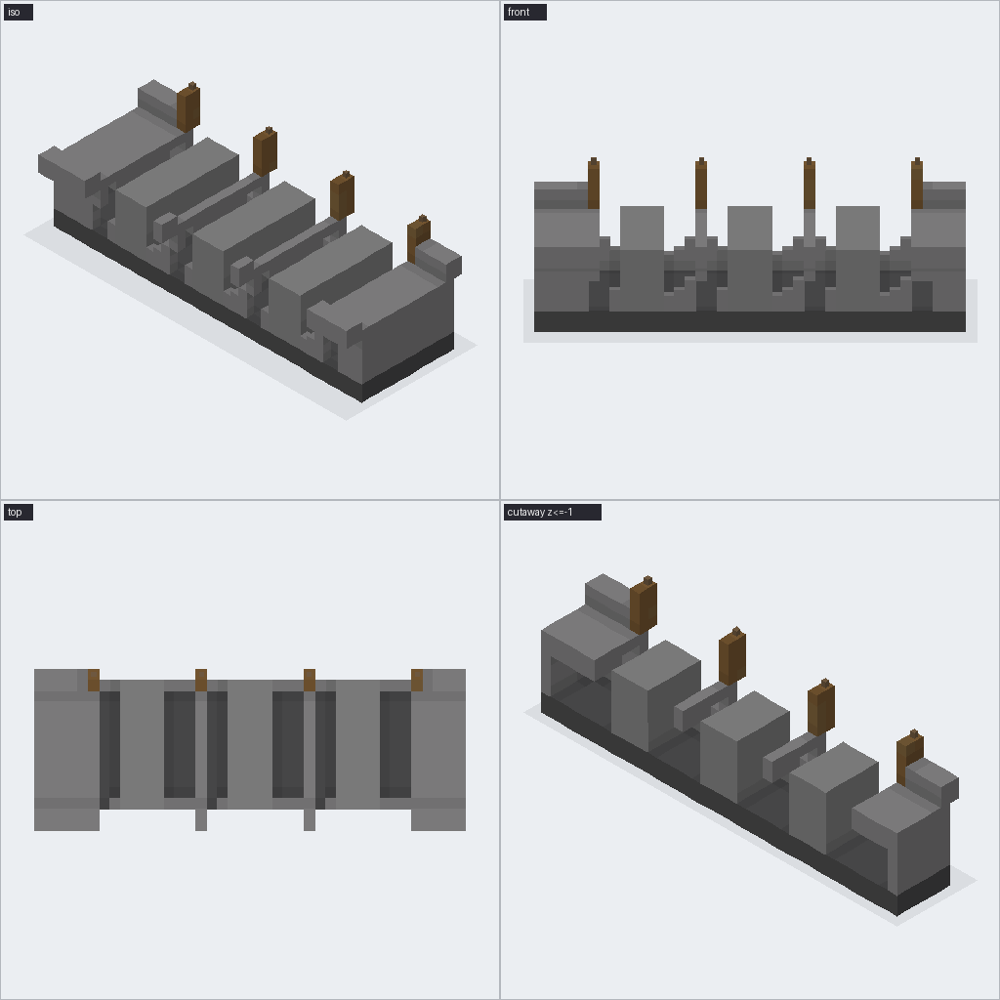

# Bench report 2026-09-19 04:12:55

mode: azure · mean score **6.56**

| build | silhouette | detail | materials | fidelity | mean | tool calls | objects | blocks | wall s | notes |
|---|---|---|---|---|---|---|---|---|---|---|
| medieval_castle | None | None | None | None | None | 70 | 37 | 12800 | 308.6 | scoring failed: Azure OpenAI (responses) failed after 2 attempts: Error code: 42 |
| modern_villa | 8 | 7 | 7 | 8 | 7.5 | 78 | 45 | 2832 | 257.2 | The villa clearly reads as a modern two-storey build with a proper cantilever, f |
| japanese_pagoda | 6 | 5 | 6 | 7 | 6.0 | 82 | 34 | 3042 | 301.1 | The build clearly has five stacked tiers, a central spire, and a stone plinth, b |
| lighthouse | 7 | 6 | 6 | 7 | 6.5 | 54 | 21 | 1067 | 152.6 | Recognisable lighthouse with attached cottage and a glass lantern room, but the  |
| stone_bridge | 6 | 6 | 6 | 7 | 6.25 | 56 | 23 | 2463 | 229.9 | The bridge reads correctly as a 40-block three-arch stone span with parapets and |

## medieval_castle

Built castle_v1: castle (medieval stone), 40x32, 26 tall, facing south: L-shaped keep, four round corner towers, curtain walls, gatehouse facing the player. 37 objects, 12,800 blocks; critic 5/10. Blocking pass completed for the medieval castle: L-shaped keep, four round towers with cone roofs, curt

## modern_villa

Built villa_modern_v1: villa (modern minimalist), 28x22, 12 tall, facing south: two-storey villa, flat roofs, cantilevered upper floor, floor-to-ceiling glass on the front. 45 objects, 2,832 blocks; critic 6/10. LLM error: Azure OpenAI (responses) failed after 2 attempts: Error code: 429 - {'error':

## japanese_pagoda

Built pagoda_v1: pagoda (japanese pagoda), 18x18, 34 tall, facing south: five-tier pagoda, sweeping tiered roofs, central spire, stone plinth. 34 objects, 3,042 blocks; critic 6/10. LLM error: Azure OpenAI (responses) failed after 2 attempts: Error code: 429 - {'error': {'message': 'Your requests to

## lighthouse

Built lighthouse_v1: lighthouse (coastal maritime), 16x16, 30 tall, facing south: tall tapered lighthouse, red and white horizontal bands, glass lantern room on top, small keeper's cottage attached. 21 objects, 1,067 blocks. Added a ground-level cottage entrance, lit the lighthouse with lanterns, an

## stone_bridge

Built stone_arch_bridge_v1: bridge (medieval stone), 40x12, 12 tall, facing south: stone arch bridge, three arches, parapets, lanterns on posts. 23 objects, 2,463 blocks; critic 5/10. LLM error: Azure OpenAI (responses) failed after 2 attempts: Error code: 429 - {'error': {'message': 'Your requests 
