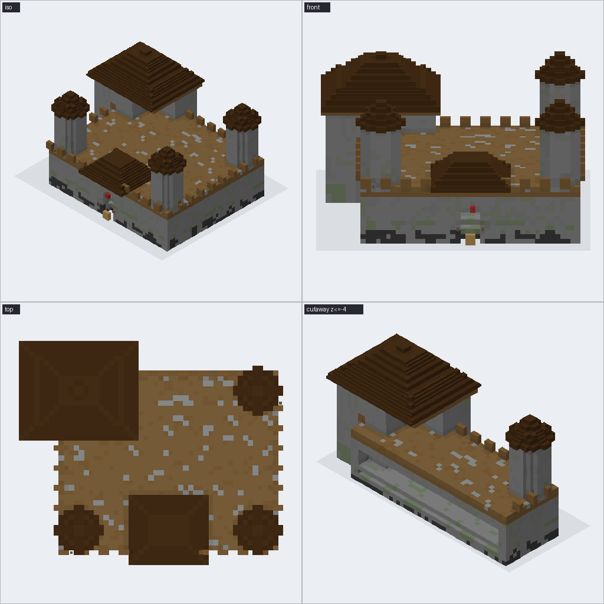
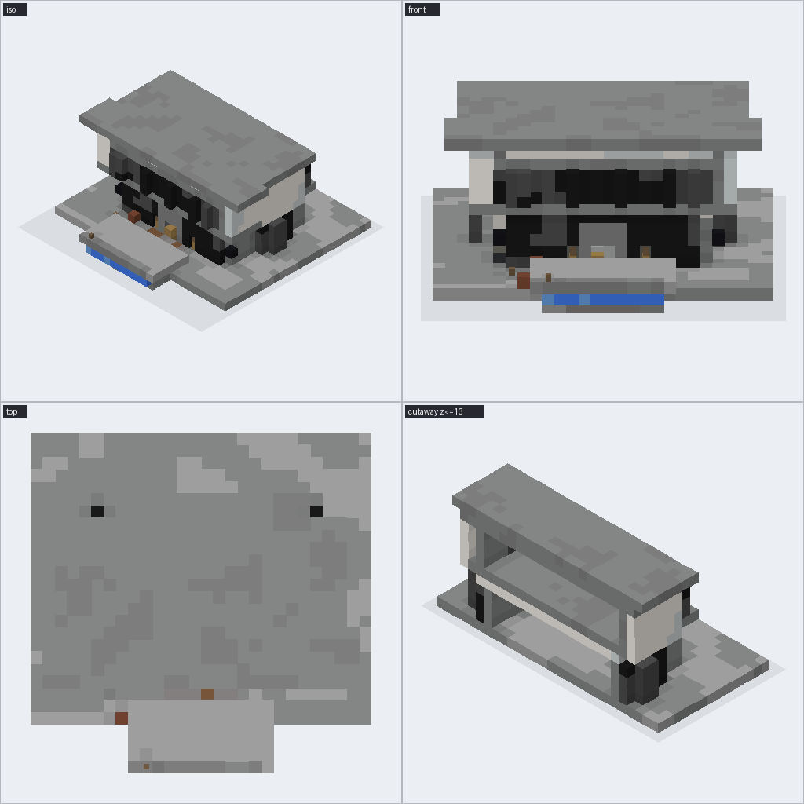
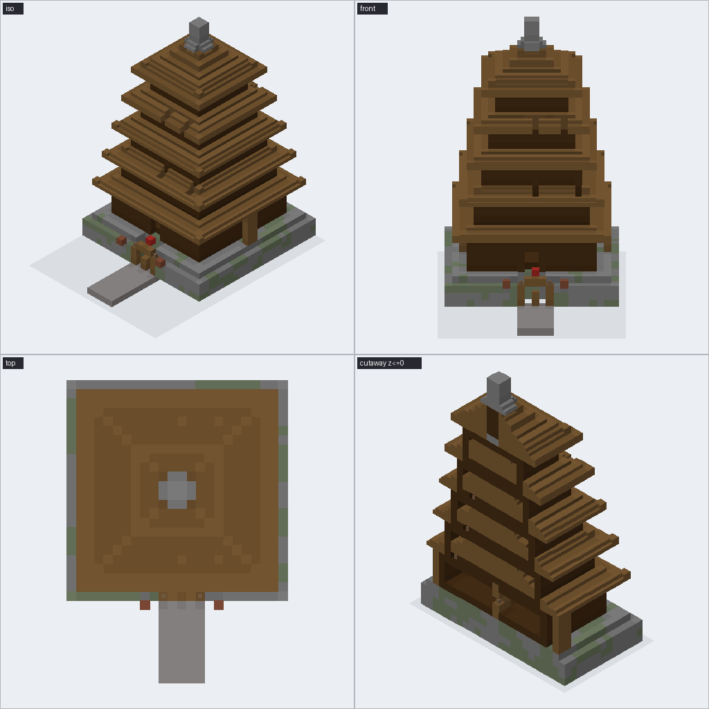
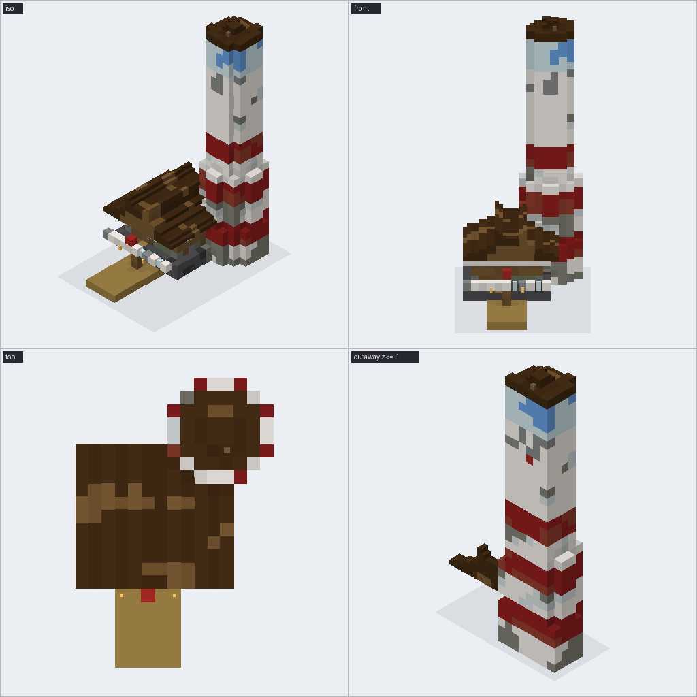
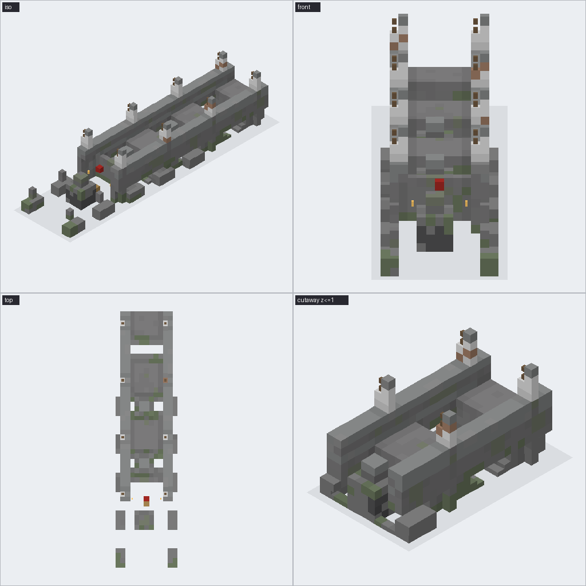

# Bench report 2026-09-19 06:18:59

mode: azure · mean score **6.35**

| build | silhouette | detail | materials | fidelity | mean | tool calls | objects | blocks | wall s | notes |
|---|---|---|---|---|---|---|---|---|---|---|
| medieval_castle | 6 | 5 | 5 | 6 | 5.5 | 13 | 47 | 18568 | 180.5 | The castle reads correctly with four round corner towers, a facing gatehouse, an |
| modern_villa | 7 | 6 | 6 | 8 | 6.75 | 20 | 61 | 2676 | 157.0 | The villa clearly reads as a modern two-storey design with a cantilevered upper  |
| japanese_pagoda | 8 | 7 | 7 | 9 | 7.75 | 15 | 39 | 7961 | 148.1 | Strong five-tier pagoda silhouette with stepped roofs, central spire, and stone  |
| lighthouse | 7 | 6 | 6 | 8 | 6.75 | 7 | 34 | 1935 | 152.9 | The build clearly includes the tapered red-and-white tower, glass lantern room,  |
| stone_bridge | 6 | 5 | 5 | 4 | 5.0 | 18 | 63 | 2155 | 145.0 | The bridge reads as a long stone span with parapets and lantern posts, but the r |

## medieval_castle

Built castle_v1: castle (medieval stone), 44x36, 30 tall, facing south: L-shaped keep, four round corner towers, curtain walls, gatehouse facing me
77×45 footprint, 30 tall, 47 objects, 18,568 blocks, in 3:00
Say `undo`, `export`, or an edit (e.g. "make the towers taller", "copper roofs").

## modern_villa

Built modern_villa_v1: villa (modern contemporary), 28x22, 14 tall, facing south: two-storey villa, flat roofs, cantilevered upper floor, floor-to-ceiling glass on the front
28×28 footprint, 13 tall, 61 objects, 2,676 blocks, in 2:36
Say `undo`, `export`, or an edit (e.g. "make the towers taller", "

## japanese_pagoda

Built pagoda_v1: pagoda (japanese temple architecture), 22x22, 34 tall, facing south: five-tier Japanese pagoda, sweeping tiered roofs, central spire, stone plinth
24×33 footprint, 41 tall, 39 objects, 7,961 blocks, in 2:28
Say `undo`, `export`, or an edit (e.g. "make the towers taller", "copper roo

## lighthouse

Built lighthouse_v1: lighthouse (coastal nautical), 18x18, 34 tall, facing south: tall tapered lighthouse, red and white bands, glass lantern room on top, small keeper's cottage attached
16×22 footprint, 35 tall, 34 objects, 1,935 blocks, in 2:32
Say `undo`, `export`, or an edit (e.g. "make the towe

## stone_bridge

Built stone_arch_bridge_v1: bridge (medieval stone), 40x10, 12 tall, facing south: stone arch bridge, three arches, parapets, lanterns on posts
12×54 footprint, 12 tall, 63 objects, 2,155 blocks, in 2:25
Say `undo`, `export`, or an edit (e.g. "make the towers taller", "copper roofs").
